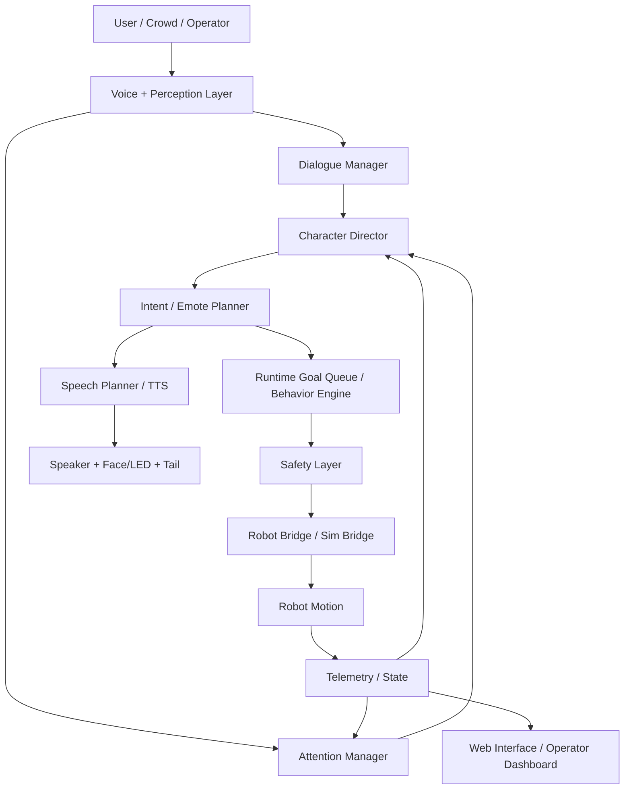

# Architecture

## Overview
This monorepo separates the project into four logical layers:

1. **Runtime core integration**
2. **Sweetie-Bot character layer**
3. **Content and asset layer**
4. **Operations and deployment layer**

## Top-level flow

## Ownership

### Runtime core
Owns:
- robot motion
- bridge selection
- safety
- plugin lifecycle
- authoritative runtime state

### Sweetie-Bot layer
Owns:
- persona state
- dialogue logic
- attention policies
- routine planning
- memory rules
- expression mapping

### Assets
Owns:
- persona YAML
- phrase banks
- routines
- prompt/style docs
- accessory presets

### Ops
Owns:
- bootstrapping
- deploy profiles
- runbooks
- log replay
- packaging helpers

## Data contracts
See:
- `docs/contracts/EVENTS.md`
- `docs/contracts/API.md`
- `docs/contracts/ASSETS.md`
- `docs/contracts/ROUTINES.md`

## Architectural decisions
See the ADRs in `docs/adr/`.
